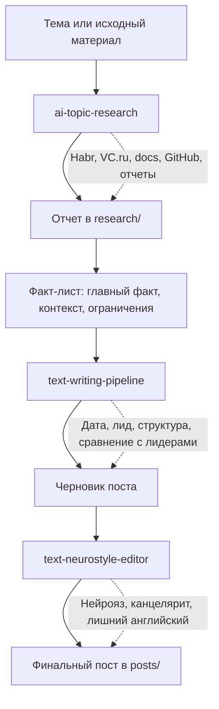

# AI News Bot

Локальный набор скиллов и материалов для пайплайна AI-исследований, написания и редактуры русскоязычных текстов.

Проект собирает три связанных процесса:

- исследование AI-тем с приоритетом на сильные источники;
- написание постов и объясняющих материалов для нетехнической аудитории;
- редактура текста против нейрояза, канцелярита и лишних англицизмов.

## Скиллы

### `ai-topic-research`

Путь: `.codex/skills/ai-topic-research/SKILL.md`

Скилл для русскоязычных исследований по AI-темам. По умолчанию ищет не меньше 10 немаркетинговых источников, сначала смотрит Habr и VC.ru, затем официальные документы, GitHub, отчеты и независимые медиа.

Что делает:

- формулирует исследовательский вопрос;
- отбирает источники без маркетинговых лендингов и SEO-страниц;
- отделяет подтвержденные факты от слабых заявлений;
- сохраняет отчет в `research/<slug>-YYYY-MM-DD.md`;
- добавляет оценку уверенности и ограничения источников.

### `text-writing-pipeline`

Путь: `.codex/skills/text-writing-pipeline/SKILL.md`

Скилл для первого черновика поста, новости, заметки или объясняющего текста. Он не занимается финальной редактурой и факт-чеком, а отвечает за структуру и понятный черновик.

Что делает:

- ставит дату в начало, если текст зависит от времени;
- начинает с события, а не с общего вступления;
- строит материал в духе РБК Трендов;
- добавляет блоки `Что случилось`, `Контекст`, `Ограничения`, `Что это значит для читателя`;
- для тем про инструменты и модели добавляет сравнение с лидерами рынка, ценами и бесплатными вариантами.

### `text-neurostyle-editor`

Путь: `.codex/skills/text-neurostyle-editor/SKILL.md`

Скилл для финального редакторского прохода. Он убирает нейрояз и выводит только отредактированный текст без комментариев.

Что делает:

- убирает пафосные вводные вроде `в современном мире`;
- вычищает негативный параллелизм вроде `не просто..., а...`;
- удаляет канцелярит и пустые экспертные фразы;
- заменяет ненужные англицизмы русскими альтернативами;
- сохраняет смысл и делает текст понятным для нетехнической аудитории.

## Пайплайн



## Структура проекта

```text
.codex/skills/
  ai-topic-research/
  text-writing-pipeline/
  text-neurostyle-editor/

research/
  *.md

posts/
  *.md
```

## Пример рабочего цикла

1. Провести исследование по AI-теме и сохранить отчет в `research/`.
2. Из отчета собрать факт-лист для нетехнической аудитории.
3. Написать черновик поста через `text-writing-pipeline`.
4. Отредактировать черновик через `text-neurostyle-editor`.
5. Сохранить финальный текст в `posts/`.

## Текущие материалы

- `research/hermes-openclaw-business-scenarios-2026-06-04.md`
- `research/free-vibe-coding-models-tools-2026-06-04.md`
- `posts/hermes-openclaw-business-agents-2026-06-04.md`
- `posts/free-vibe-coding-tools-2026-06-04.md`
